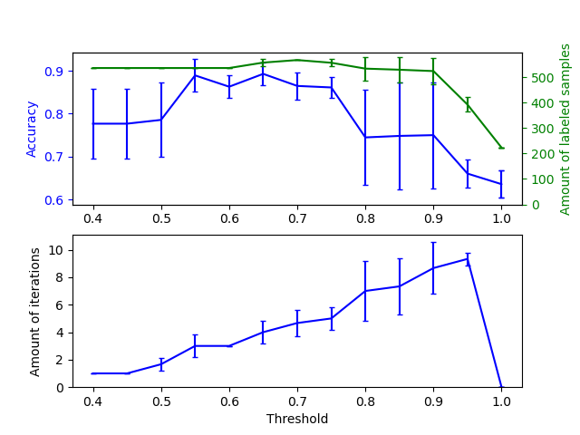

# Effect of varying threshold for self-training
This example illustrates the effect of a varying threshold on self-training. The breast_cancer dataset is loaded, and labels are deleted such that only 50 out of 569 samples have labels. A SelfTrainingClassifier is fitted on this dataset, with varying thresholds.

The upper graph shows the amount of labeled samples that the classifier has available by the end of fit, and the accuracy of the classifier. The lower graph shows the last iteration in which a sample was labeled. All values are cross validated with 3 folds.

At low thresholds (in [0.4, 0.5]), the classifier learns from samples that were labeled with a low confidence. These low-confidence samples are likely have incorrect predicted labels, and as a result, fitting on these incorrect labels produces a poor accuracy. Note that the classifier labels almost all of the samples, and only takes one iteration.

For very high thresholds (in [0.9, 1)) we observe that the classifier does not augment its dataset (the amount of self-labeled samples is 0). As a result, the accuracy achieved with a threshold of 0.9999 is the same as a normal supervised classifier would achieve.

The optimal accuracy lies in between both of these extremes at a threshold of around 0.7.

[参考链接](https://scikit-learn.org/stable/auto_examples/semi_supervised/plot_self_training_varying_threshold.html#sphx-glr-auto-examples-semi-supervised-plot-self-training-varying-threshold-py)